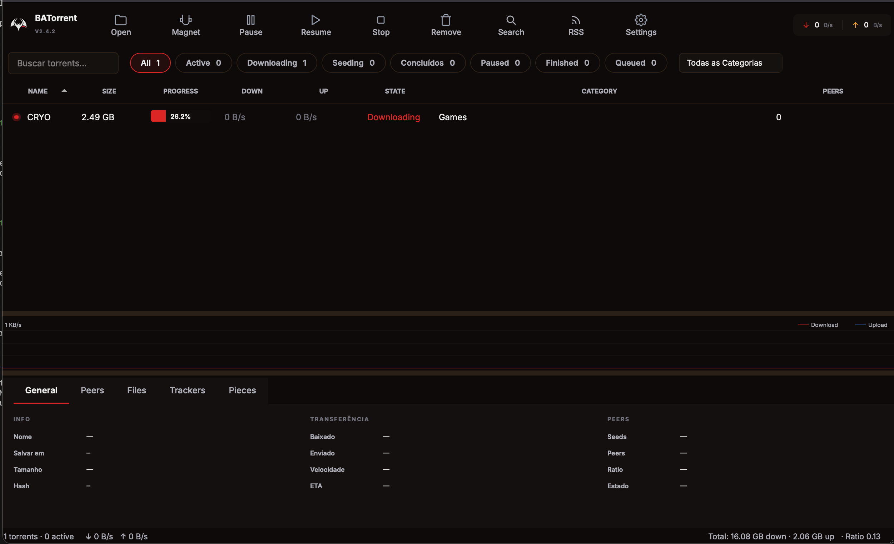
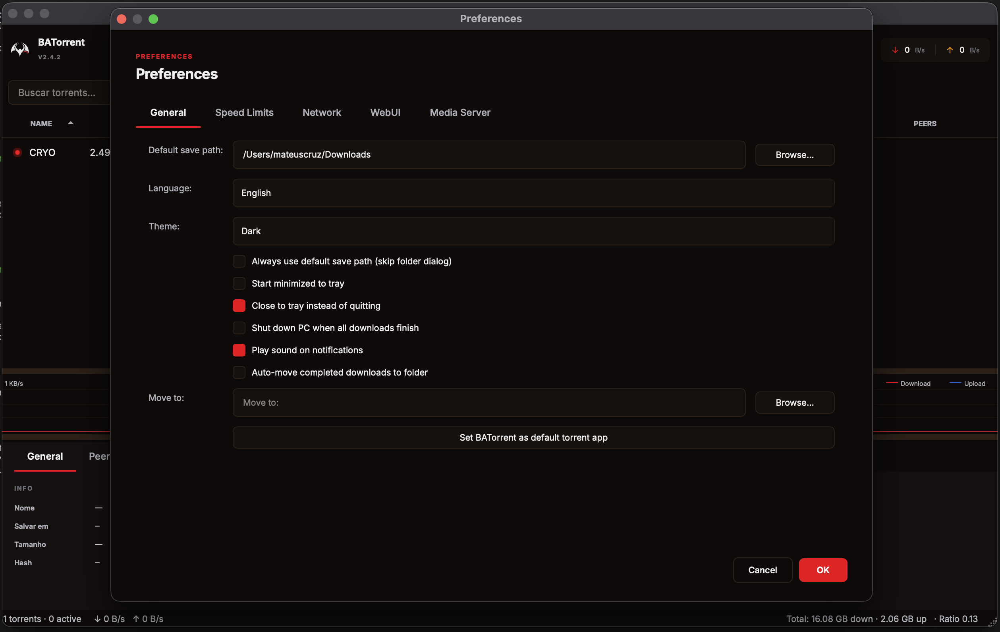
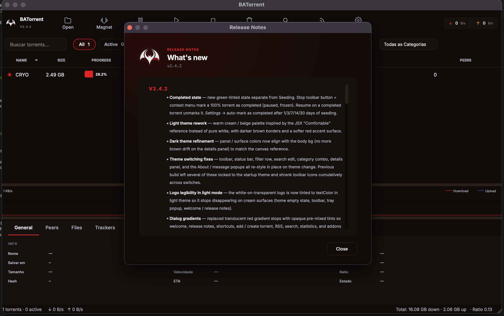
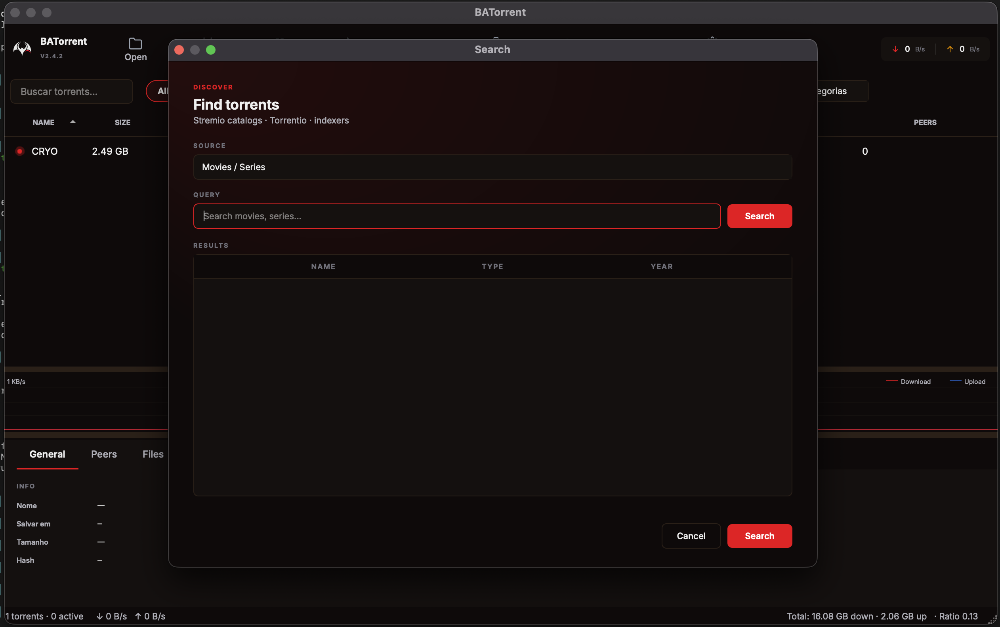

<p align="center">
  
</p>

<h1 align="center">BATorrent</h1>

</p>

<p align="center">
  <a href="https://github.com/Mateuscruz19/BAT-Torrent/releases/latest"></a>
  <a href="https://github.com/Mateuscruz19/BAT-Torrent/releases"></a>
  <a href="LICENSE"></a>
  
  
  
</p>


## Overview

BATorrent is a desktop BitTorrent client that prioritises clarity, performance, and privacy. It pairs the mature libtorrent-rasterbar engine with a hand-tuned Qt 6 interface, a remote-control WebUI, RSS auto-downloading, Stremio-compatible search, VPN-aware traffic isolation, and built-in media-server integration.










## Download

Pre-built binaries for the latest release:

| Platform | Format | Notes |
|---|---|---|
| Windows | [Installer (`.exe`)](https://github.com/Mateuscruz19/BAT-Torrent/releases/latest) · [Portable (`.zip`)](https://github.com/Mateuscruz19/BAT-Torrent/releases/latest) | Windows 10+ (x86_64) |
| macOS | [Disk image (`.dmg`)](https://github.com/Mateuscruz19/BAT-Torrent/releases/latest) | macOS 12+ (Apple Silicon) |
| Linux | [AppImage](https://github.com/Mateuscruz19/BAT-Torrent/releases/latest) | Glibc 2.35+ (x86_64) |

All artefacts are produced by the [Build & Release](.github/workflows/build.yml) workflow on every tagged release.


## Features

### Torrents
- `.torrent` files and magnet links with persistent resume data
- Per-file priority, sequential download, manual recheck and reannounce
- Auto-tracker injection from [ngosang/trackerslist](https://github.com/ngosang/trackerslist)
- Categories, drag-and-drop reorder, and right-click context actions
- Import existing state from qBittorrent
- Create new `.torrent` files from any file or folder

### State management
- **Completed** state — manually marked or auto-promoted after a configurable seeding window (1, 3, 7, 14, or 30 days). Distinct from Seeding/Finished, persisted across restarts.
- **Stop button** that freezes a finished torrent without removing it; **Resume** un-marks and re-enters the seeding pool.
- Stop-seeding rules: global ratio limit and maximum seed time, with per-torrent overrides.
- **Auto-pause on file errors** — if libtorrent can't read a finished torrent's files (e.g. external drive unplugged), it pauses instead of silently re-downloading.

### Discovery
- **RSS auto-download** with regex filters, per-feed save paths, interval scheduling, and duplicate detection. Handles magnet links, `.torrent` URLs, and `<enclosure>` tags.
- **Stremio-compatible search** for movies and series via the bundled Cinemeta and Torrentio addons.

### Streaming
- Play while downloading — `.mp4`, `.mkv`, `.avi`, `.mov`, `.wmv`, `.flv`, `.webm`, `.m4v`, `.ts`.
- Auto-detects VLC and IINA, falls back to the system default player.

### VPN & privacy
- **Interface binding** locks all torrent traffic to a chosen network interface (e.g. `tun0`, `utun4`).
- **Kill switch** pauses every active torrent the moment the bound interface drops, with optional auto-resume when it returns.
- VPN detection for WireGuard, Mullvad, NordLynx, ProtonVPN, generic tun/tap.
- SOCKS5 and HTTP proxy with authentication.
- IP blocklist support (P2P format).
- Protocol encryption: enabled / forced / disabled.

### WebUI
- Browser-based control panel on `http://localhost:8080` (port and remote access configurable).
- REST API with JSON responses; add by magnet or `.torrent` upload; pause / resume / remove; per-torrent file and peer views.
- SHA-256 hashed Basic Auth, theme-matched dark UI.

### Bandwidth & scheduling
- Independent download and upload limits.
- Alternative speed profile with hour-of-day + day-of-week schedule (overnight ranges supported).
- Per-torrent and global seed-ratio and seed-time limits.

### Media-server integration
- Notifies **Plex**, **Jellyfin**, or **Emby** to scan the library when a download completes.
- Configurable URL and token / API key per server.

### Interface
- Three themes — Dark, Light (warm cream "Comfortable" palette), and Midnight — with a global QPalette override so plain widgets follow the active theme.
- Real-time speed graph, detailed panel (General · Peers · Files · Trackers · Pieces), state-coloured progress bars, click-to-focus tray notifications.
- Custom tray popup (cross-platform) with live speeds, active-torrent preview, VPN status, and quit affordance.
- Filter pills with live counts (All / Active / Downloading / Seeding / Completed / Paused / Finished / Queued), search bar, and category filter.
- Drag and drop for both `.torrent` files and magnet links.
- Seven UI languages: English, Português (BR), Español, Deutsch, Русский, 日本語, 中文 — with English fallback for missing keys.

### System
- Auto-update channel reading from GitHub releases (AppImage / installer / DMG).
- Auto-shutdown when all downloads complete (60 s cancellable countdown).
- CLI args: pass any number of `.torrent` paths or `magnet:` URIs at launch; subsequent launches forward to the running instance.
- Keyboard shortcuts and `?` quick-reference dialog.


## Getting started

1. Download the build for your platform from the [releases page](https://github.com/Mateuscruz19/BAT-Torrent/releases/latest).
2. On first launch the welcome dialog walks through the default save path, theme, and language.
3. Drag a `.torrent` file or magnet link onto the window — or use **File → Open Torrent** / **File → Add Magnet**.
4. Optional: bind the outgoing interface in **Settings → VPN** and enable the kill switch before adding sensitive torrents.

> **VPN tip:** when **Interface binding** is set, every announce and peer connection leaves through that interface only. If the interface goes down, the kill switch pauses everything until it comes back.


## Build from source

### Requirements
- C++17 toolchain (GCC 11+, Clang 14+, or MSVC 19.30+)
- CMake 3.16+
- Qt 6 (`Widgets`, `Network`, `Svg`, `Multimedia`)
- libtorrent-rasterbar 2.0+
- Boost (transitive dependency of libtorrent)
- Optional: Qt6Keychain (stores credentials in the OS keyring instead of plaintext QSettings)

### Linux

```bash
# Debian / Ubuntu
sudo apt install build-essential cmake \
    qt6-base-dev qt6-svg-dev qt6-multimedia-dev \
    libtorrent-rasterbar-dev libboost-dev libssl-dev

# Arch
sudo pacman -S cmake qt6-base qt6-svg qt6-multimedia \
    libtorrent-rasterbar boost openssl

cmake -B build -DCMAKE_BUILD_TYPE=Release
cmake --build build -j
./build/BATorrent
```

### macOS

```bash
brew install qt libtorrent-rasterbar boost openssl
cmake -B build -DCMAKE_BUILD_TYPE=Release \
    -DCMAKE_PREFIX_PATH="$(brew --prefix qt);$(brew --prefix libtorrent-rasterbar);$(brew --prefix openssl)"
cmake --build build -j
open build/BATorrent.app
```

### Windows

Install Qt 6 via the official installer and libtorrent via vcpkg:

```powershell
vcpkg install libtorrent:x64-windows
cmake -B build -DCMAKE_TOOLCHAIN_FILE="$env:VCPKG_ROOT\scripts\buildsystems\vcpkg.cmake"
cmake --build build --config Release
```

### Tests

The test suite is opt-in:

```bash
cmake -B build -DBAT_BUILD_TESTS=ON
cmake --build build
ctest --test-dir build
```


## Project layout

```
src/
├── torrent/      libtorrent wrapper, resume data, queue, seeding rules
├── app/          translator, updater, RSS, addons, secret store, GeoIP
├── gui/          Qt Widgets UI (main window, dialogs, details, tray popup)
├── webui/        embedded HTTP server + browser UI
└── main.cpp      single-instance bootstrap, CLI parsing, theming
.github/
└── workflows/    Linux AppImage, macOS DMG, Windows installer + zip
installer/        Inno Setup script for the Windows installer
dist/             desktop file + assets for Linux packaging
```


## Contributing

Issues and pull requests are welcome. For non-trivial changes, please open an issue first to discuss the approach. Pre-built artefacts can be produced for any branch via the **Build & Release** workflow (`workflow_dispatch`).

When reporting a bug, attach:
- Platform + version (`Help → About`)
- Steps to reproduce
- The relevant section of `~/.local/share/BATorrent/` (Linux), `~/Library/Application Support/BATorrent/` (macOS), or `%APPDATA%\BATorrent\` (Windows) if it involves resume data or settings.


## License

[MIT](LICENSE) © 2024–2026 Mateus Cruz
